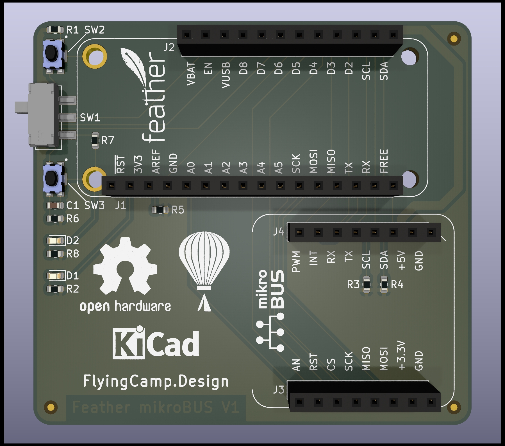

# feather-mikrobus
A simple [Adafruit Feather](https://www.adafruit.com/feather) to [mikroBUS](https://www.mikroe.com/mikrobus) socket adapter board.

## Hardware

Hardware source files for [KiCad](https://kicad-pcb.org/) are available in the `hardware/` directory.  For details on features and pinouts, see the individual `README.md` for each hardware version.

### [feather-mikrobus-v1](hardware/feather-mikrobus-v1/)

